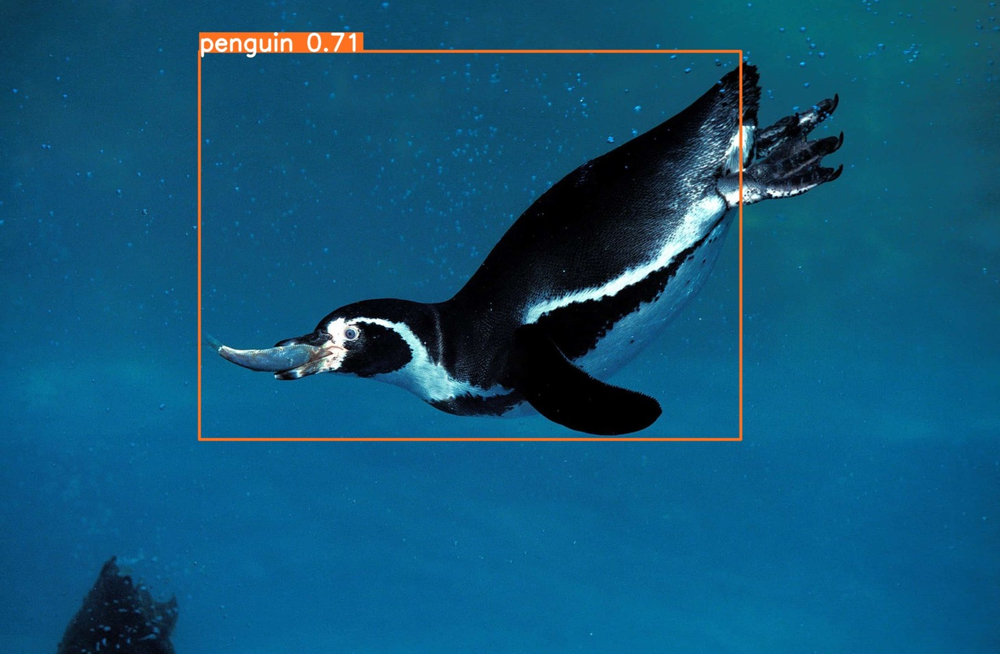

# Underwater Object Detection 🐟🦈🐧

I am thrilled to present my first object detection project using `YOLOv8`, which achieves an impressive Mean Average Precision (mAP) of over `70%`. This project focuses on detecting various marine life forms, including fish, jellyfish, penguin, puffin, shark, starfish, and stingray. As a novice in the field of object detection, this endeavor marks an exciting milestone in my journey into computer vision and machine learning. Through this project, I aimed to hone my skills in model development, data preprocessing, and evaluation techniques, while also gaining practical experience in deploying object detection systems. I hope this project serves as a testament to my passion for exploring cutting-edge technologies in the realm of data science and showcases my commitment to continuous learning and improvemen

To execute the streamlit application -
```
python -m streamlit run underwater_objects.py
```


## 🚀 About Me
👋 Hi there! I'm **Mainak Mukherjee**, a passionate and ambitious B.Tech student with a strong drive to become a Data Scientist and Data Analyst. Welcome to my data-driven journey!


## Python Libraries used

- numpy
- ultralytics
- matplotlib
- seaborn
- tensorflow
- streamlit
- moviepy
- os
- cv2
- cvzone
- shutil


## Link for the dataset

[Kaggle](https://www.kaggle.com/datasets/slavkoprytula/aquarium-data-cots)


## Author

- [@Mainakcris7](https://github.com/Mainakcris7)

## Feedback

If you have any feedback, please reach out to me at mainakcr72002@gmail.com
